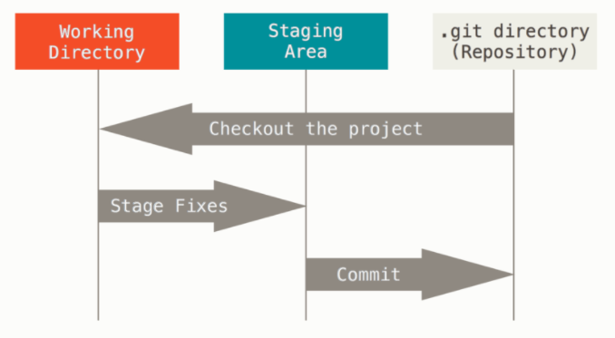

### Git basic

git의 기초를 배워요


## WARNING

1. Home 폴더(~)를 리포로 업그레이드 하지 않는다.
2. 리포 안에 리포를 두지 않는다.(리포 안에 폴더에서 git init 하지 않는다.)


## git 기본

`mkdir  learn_git` 을 이용하여 learn_git 폴더 만들기

`cd learn_git`  폴더로 이동

**절대 home 폴더에서 하지않기**

`git init`를 활용 하여 폴더에 기능 추가(리포 or 저장소라고 부름)

그러면 learn_git 폴더에 민트색으로 (master)가 붙음

`ls -a` 리눅스 계열에서 .으로 시작하면 숨김폴더

`rm -rf .git`강제 삭제


## git name &  email 변경

`git config --global user.name "leedong"` 이름변경

`git config --global user.email "leedong9311@gmail.com"` 이메일변경


## 저장소 초기화 하기

```
$ git init
```


## 저장소를 일반 디렉토리로 되돌리기

```
$ rm -rf .git
```


## stage 에 올리기 (staging)

특정 파일만 스테이지에 올리기

```
$ git add <filename>
```

현재 위치의 모든 파일을 스테이지에 올리기

``` 
$ git add .
```


##  커밋 로그 확인하기

```
$ git log
$ git log --oneline
```


## commit 을 통해 스냅샷 저장하기


### - 현재 상황 확인하기

```
$ git status
```


## git 비유



화보 촬영에 예를 들면 Working Directory는 분장실 Staging Area는 스테이지 

git directory는 촬영장  분장을 해서 스테이지에 올리는 것은 add를 사용해서 (stage Fixes)올리고 스테이지에서 commit을 이용하며 촬영을 한다고 생각하면 된다.


## git commit reset

git reset HEAD~

전에 기록 삭제


## 리모트 연결하기

``` 
$ git reomote add <name> <URL>

#리모트 삭제하기
$ git remote remove <name>

#리모트 이름바꾸기
$ git remote rename <old> <new>
```


## 리모트에 PUSH하기

리모트에 업로드

```
$ git push <name> <branch>
```


## 리모트에서 최초 CLONE 받기

리모트 리포 내용을 그대로 복제

```
$ git clone <URL>
```


## 리모트에서 PULL하기

리모트에서 다운로드

```
$ git 
```

